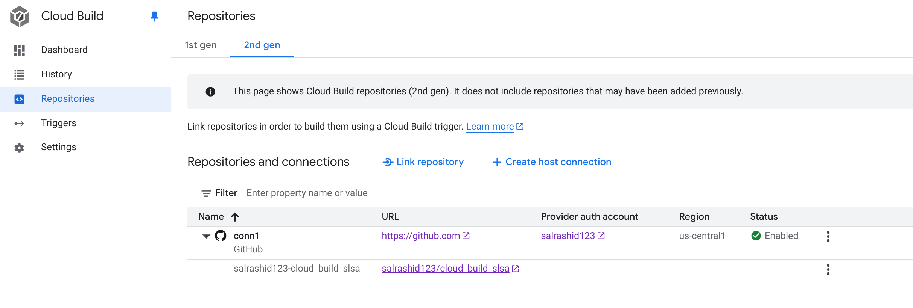
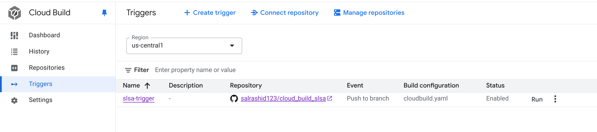
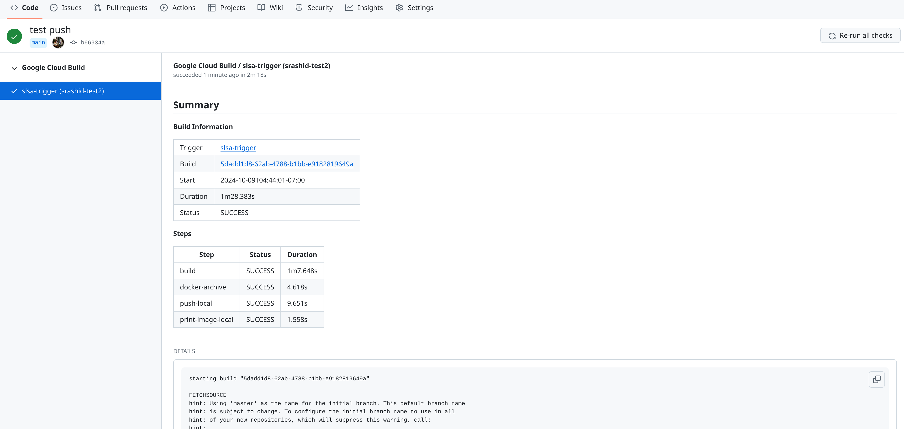
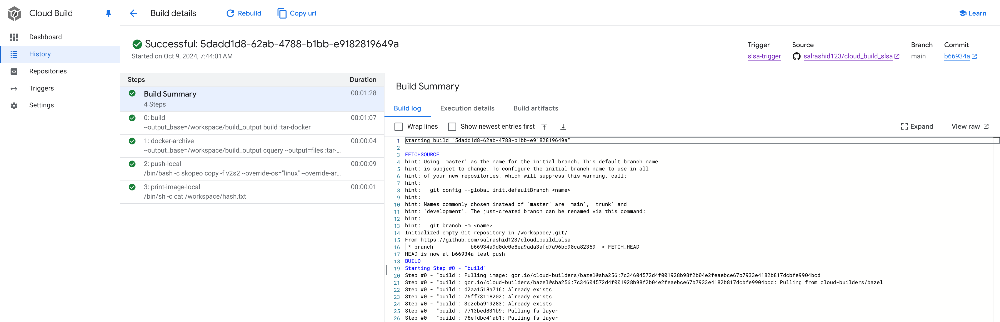
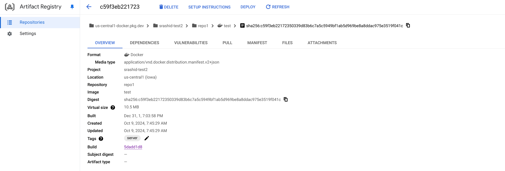

## Deterministic builds with Bazel and Cloud Build SLSA provenance

Sample which demonstrates end-to-end build+push of a container image which includes a verifiable GCP [build provenance statement](https://cloud.google.com/build/docs/securing-builds/generate-validate-build-provenance)

eg

```
source -> 
   git push -> 
      cloud_build_trigger -> 
         deterministic build -> 
            push container image to artifact registry -> 
               signed SLSA statement
```

### Setup

You must first configure a git repo to use for this test which has a connection to GCP cloud build:

see [Create and manage build triggers](https://cloud.google.com/build/docs/automating-builds/github/connect-repo-github?generation=2nd-gen)

```bash
export PROJECT_ID=`gcloud config get-value core/project`
export PROJECT_NUMBER=`gcloud projects describe $PROJECT_ID --format='value(projectNumber)'`
export CLOUD_BUILD_SERVICE_AGENT="service-$PROJECT_NUMBER@gcp-sa-cloudbuild.iam.gserviceaccount.com"

gcloud source repos create cloud_build_slsa
gcloud source repos clone cloud_build_slsa

gcloud projects add-iam-policy-binding $PROJECT_ID \
  --member="serviceAccount:$CLOUD_BUILD_SERVICE_AGENT" \
  --role="roles/secretmanager.admin"

gcloud builds connections create github conn1 --region=us-central1
```

Create a connection



Create a Trigger




### Build and Push

Now build and push to your own repo

```bash
git add -A
git commit -m "add" 

git push
```

If you enabled logging to github, this will also show up here in github



and cloud build



The final image in this example was generated here from the commit [b66934a9d0dc0e8ea9ada3afd7a96bc90ca82359](https://github.com/salrashid123/cloud_build_slsa/commit/b66934a9d0dc0e8ea9ada3afd7a96bc90ca82359)

as a result of run [https://github.com/salrashid123/cloud_build_slsa/runs/31291193366](https://github.com/salrashid123/cloud_build_slsa/runs/31291193366)



so to verify the provenance doc:

```bash
export IMAGE="us-central1-docker.pkg.dev/srashid-test2/repo1/test@sha256:c59f3eb22172350339d83b6c7a5c5949bf1ab5d969be8a8ddac975e3519f041c"
export BUILDER_ID="https://cloudbuild.googleapis.com/GoogleHostedWorker"
export SOURCE="https://github.com/salrashid123/cloud_build_slsa"

### get the provenance statement
gcloud artifacts docker images describe $IMAGE --format json --show-provenance > provenance.json

### verify using slsa-verifier

$ slsa-verifier verify-image "$IMAGE" \
--provenance-path provenance.json \
--source-uri $SOURCE \
--builder-id=$BUILDER_ID

  Verification succeeded with key "global-pae-provenanceSigner_1"
  PASSED: SLSA verification passed
```

- `provenance.json`:

```json
{
  "_type": "https://in-toto.io/Statement/v1",
  "subject": [
    {
      "name": "https://us-central1-docker.pkg.dev/srashid-test2/repo1/test:server",
      "digest": {
        "sha256": "c59f3eb22172350339d83b6c7a5c5949bf1ab5d969be8a8ddac975e3519f041c"
      }
    }
  ],
  "predicateType": "https://slsa.dev/provenance/v1",
  "predicate": {
    "buildDefinition": {
      "buildType": "https://cloud.google.com/build/gcb-buildtypes/google-worker/v1",
      "externalParameters": {
        "substitutions": {},
        "buildConfigSource": {
          "path": "cloudbuild.yaml",
          "ref": "refs/heads/main",
          "repository": "git+https://github.com/salrashid123/cloud_build_slsa"
        }
      },
      "internalParameters": {
        "triggerUri": "projects/708288290784/locations/us-central1/triggers/7983e852-ba43-4b82-9a91-8ac3c05aafd6",
        "systemSubstitutions": {
          "BRANCH_NAME": "main",
          "COMMIT_SHA": "b66934a9d0dc0e8ea9ada3afd7a96bc90ca82359",
          "REVISION_ID": "b66934a9d0dc0e8ea9ada3afd7a96bc90ca82359",
          "REPO_FULL_NAME": "salrashid123/cloud_build_slsa",
          "SHORT_SHA": "b66934a",
          "TRIGGER_NAME": "slsa-trigger",
          "PROJECT_NUMBER": "708288290784",
          "REPO_NAME": "cloud_build_slsa",
          "LOCATION": "us-central1",
          "SERVICE_ACCOUNT": "708288290784@cloudbuild.gserviceaccount.com",
          "SERVICE_ACCOUNT_EMAIL": "708288290784@cloudbuild.gserviceaccount.com",
          "BUILD_ID": "5dadd1d8-62ab-4788-b1bb-e9182819649a",
          "TRIGGER_BUILD_CONFIG_PATH": "cloudbuild.yaml",
          "REF_NAME": "main"
        }
      },
      "resolvedDependencies": [
        {
          "uri": "git+https://github.com/salrashid123/cloud_build_slsa@refs/heads/main",
          "digest": {
            "gitCommit": "b66934a9d0dc0e8ea9ada3afd7a96bc90ca82359"
          }
        },
        {
          "uri": "docker.io/busybox@sha256:768e5c6f5cb6db0794eec98dc7a967f40631746c32232b78a3105fb946f3ab83",
          "digest": {
            "sha256": "768e5c6f5cb6db0794eec98dc7a967f40631746c32232b78a3105fb946f3ab83"
          }
        },
        {
          "uri": "gcr.io/cloud-builders/bazel@sha256:7c34604572d4f001928b98f2b04e2feaebce67b7933e4182b817dcbfe9904bcd@sha256:7c34604572d4f001928b98f2b04e2feaebce67b7933e4182b817dcbfe9904bcd",
          "digest": {
            "sha256": "7c34604572d4f001928b98f2b04e2feaebce67b7933e4182b817dcbfe9904bcd"
          }
        },
        {
          "uri": "quay.io/containers/skopeo:v1.16.1@sha256:5b7af4208063e6db28a20a096b0694b7c725eedd101348618f97988cfe069b9d",
          "digest": {
            "sha256": "5b7af4208063e6db28a20a096b0694b7c725eedd101348618f97988cfe069b9d"
          }
        }
      ]
    },
    "runDetails": {
      "builder": {
        "id": "https://cloudbuild.googleapis.com/GoogleHostedWorker"
      },
      "metadata": {
        "invocationId": "https://cloudbuild.googleapis.com/v1/projects/srashid-test2/locations/us-central1/builds/5dadd1d8-62ab-4788-b1bb-e9182819649a",
        "startedOn": "2024-10-09T11:44:01.236836953Z",
        "finishedOn": "2024-10-09T11:45:29.619914Z"
      },
      "byproducts": [
        {}
      ]
    }
  }
}
```


## References

- [Deterministic container hashes and container signing using Cosign, Kaniko and Google Cloud Build](https://github.com/salrashid123/cosign_kaniko_cloud_build)
- [Deterministic builds with go + bazel + grpc + docker](https://github.com/salrashid123/go-grpc-bazel-docker)
- [Deterministic container hashes and container signing using Cosign, Bazel and Google Cloud Build](https://github.com/salrashid123/cosign_bazel_cloud_build)
- [Deterministic container images with java and GCP APIs using bazel](https://github.com/salrashid123/java-bazel-docker)
- [Deterministic container images with python and GCP APIs using bazel](https://github.com/salrashid123/python-bazel-docker)
- [Deterministic container images with c++ and GCP APIs using bazel](https://github.com/salrashid123/cpp-bazel-docker)
- [Deterministic builds with nodejs + bazel + docker](https://github.com/salrashid123/nodejs-bazel-docker)


